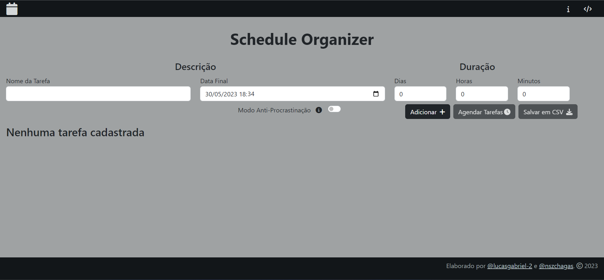
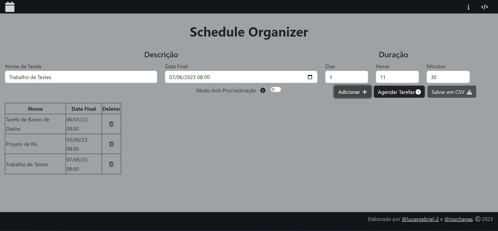
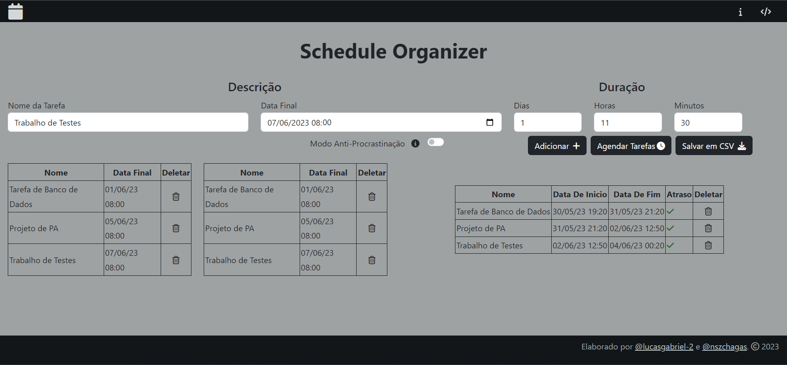
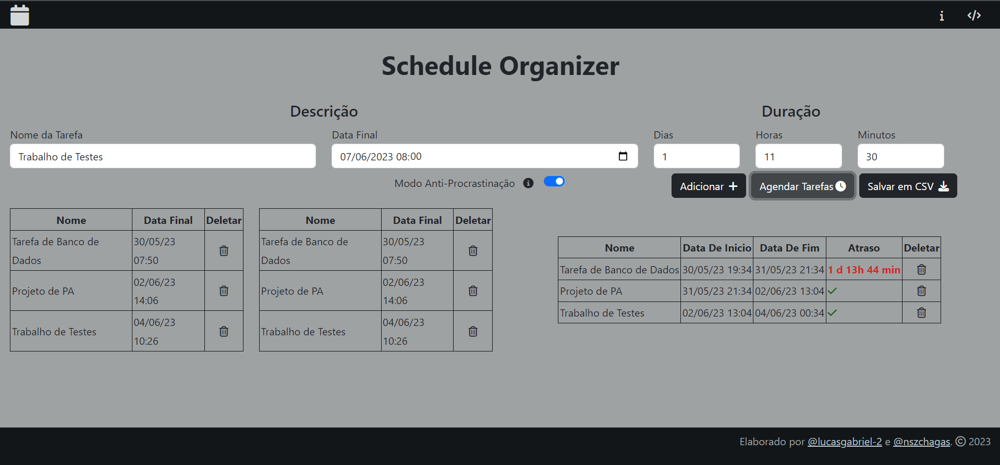
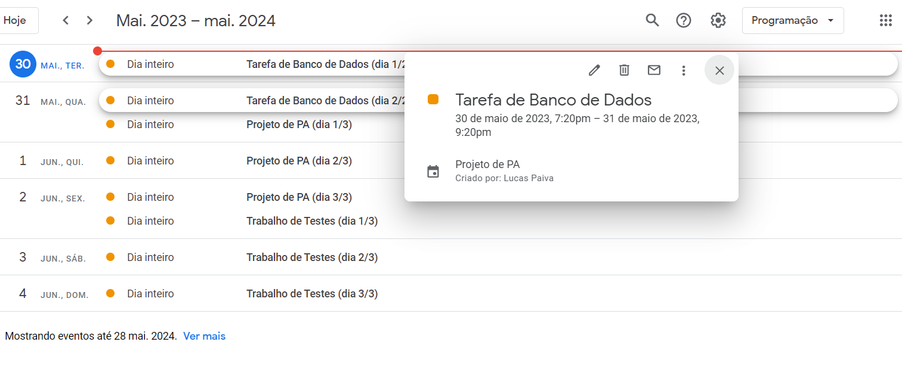

# Schedule Organizer

**Número da Lista**: Dupla 06 (T01)<br>
**Conteúdo da Disciplina**: Greed<br>

## Alunos

| Matrícula  | Aluno                                                                   |
| ---------- | ----------------------------------------------------------------------- |
| 19/0112123 | [Lucas Gabriel Sousa Carmargo Paiva](https://github.com/lucasgabriel-2) |
| 20/0042327 | [Nicolas Chagas Souza](https://github.com/nszchagas)                    |

## Sobre

Esse projeto visa verificar qual o menor atraso mínimo possível para se realizar um conjunto de tarefas, utilizando o algoritmo **Scheduling to Minimize Lateness** [1] e ao final fornece a possibilidade do usuário baixar um arquivo CSV para agendar essas tarefas no [Google Calendar](https://calendar.google.com/), além disso o usuário poderá ativar um Modo Anti-Procrastinação no qual o prazo de entrega de todas as tarefas é reduzido em um tempo aleatório de até 3 dias.

Para isso, foi implementado o algoritmo QuickSort com a otimização da mediana de três elementos [2] para ordenar as tarefas por ordem crescente de data de entrega e em seguida agenda-las nessa mesma ordem, seguindo assim o algoritmo Scheduling to Minimize Lateness.

## Screenshots



<center> Figura 1 - Tela inicial.</center><br>



<center> Figura 2 - Exemplo de adição de tarefas.</center><br>



<center> Figura 3 - Exemplo de agendamento de tarefas.</center><br>



<center> Figura 4 - Exemplo de agendamento de tarefas com o modo procrastinador ativado.</center><br>



<center> Figura 5 - Exemplo de utilização de arquivo CSV.</center><br>

## Instalação

**Linguagem**: Javascript<br/>
**Framework**: Não há<br/>

Para rodar o projeto localmente é necessário ter Node (^16.0.0) instalado na máquina. Recomendamos a utilização do Node Version Manager (nvm) para instalação da versão correta do node, você pode seguir a [documentação](https://github.com/nvm-sh/nvm/blob/master/README.md#installing-and-updating) do nvm para realizar a instalação. Em seguida execute os seguintes comandos na pasta raiz do projeto a mesma onde se encontra o [package.json](./package.json).

```shell

nvm install 16.0.0
nvm use 16.0.0

```

- É **necessário** instalar as dependências do projeto, executando o seguinte comando na pasta raiz do projeto.

```shell

npm install

```

- Para rodar o projeto, basta executar o comando abaixo na raiz do projeto.

```shell

npm run start

```

> Esse comando executará o script start definido no [package.json](./package.json), ou seja, iniciará o servidor expondo a porta: 8080.

> Confira o aplicativo rodando em: [http://127.0.0.1:8080/](http://127.0.0.1:8080/). :)

## Uso

Para usar o projeto, acesse a página ([local](http://127.0.0.1:8080/) ou no [github](https://projeto-de-algoritmos.github.io/Greed_ScheduleOrganizer/)), adicione as atividades desejados, agende as tarefas (com ou sem o modo procastinador), após o processamento salve o arquivo CSV e o utilize para agendar suas tarefas no [Google Calendar](https://calendar.google.com/).

## Outros

<!-- <video src='./assets/explicaoCSV.mp4'></video>

[Explicação de como adicionar arquivo ao Google Calendar](./assets/explicaoCSV.mp4) -->

## Apresentação

<video src='./assets/gravacao.mp4'></video>

[Arquivo de apresentação](./assets/gravacao.mp4)

## Referências

[1] KLEINBERG, Jon; TARDOS, Eva. Algorithm design. Pearson Education India, 2006.

[2] CORMEN, Thomas H. et al. Introduction to algorithms. MIT press, 2022.
